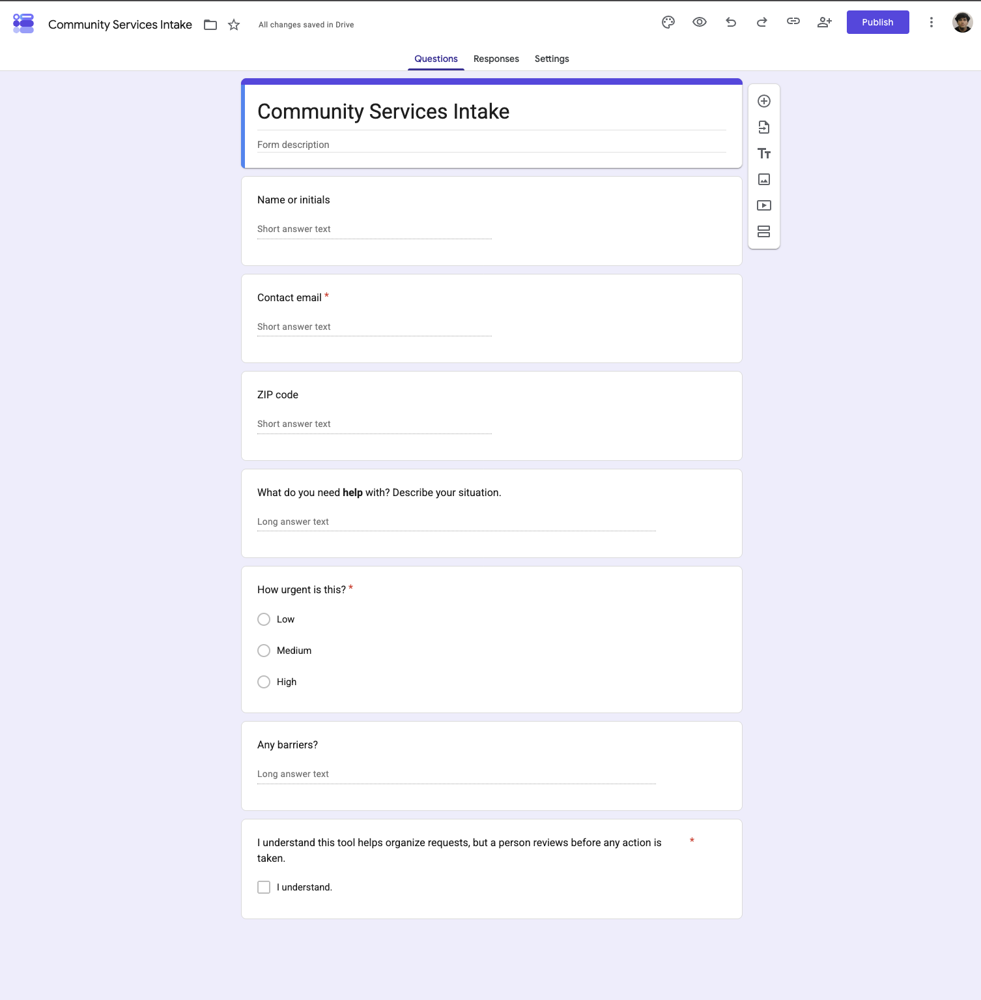
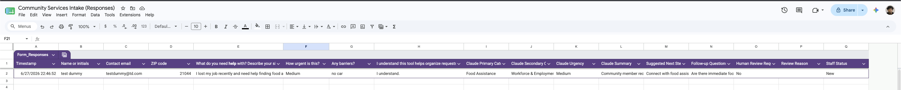
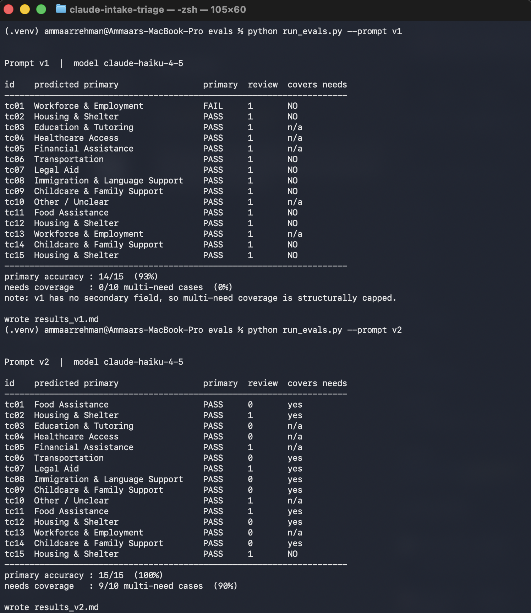

# Claude Intake Triage Assistant

A lightweight intake-triage workflow for small community-service organizations.
A community member submits a request through a Google Form; Claude reads it and
returns structured triage fields — category, urgency, a short summary, suggested
next step, follow-up questions, and a human-review flag — written straight back
into the Google Sheet for staff to review. **A person reviews every request
before any action is taken.**

**▶ [Watch the 90-second demo](https://www.loom.com/share/c43efcd9c3314bcd9cda3002282d31a5)**

## Problem

Small nonprofits, student-support offices, and constituent-service teams get
requests as messy free text through forms and email. Sorting, summarizing, and
routing them by hand is slow, and urgent or mixed-need requests get missed.

## Demo

| Intake form | Triaged output in Sheets |
|-------------|--------------------------|
|  |  |

Eval harness (v1 → v2 improvement — primary accuracy 93% → 100%, multi-need coverage 0% → 90%):



## What it does

```
Google Form  ->  Google Sheet  ->  Apps Script  ->  Claude API  ->  structured row
   (intake)       (responses)      (on submit)     (triage)        (staff review)
```

For an intake like *"I lost my job and need food assistance and resume help, no
car,"* Claude returns:

- **Primary category:** Food Assistance
- **Secondary:** Workforce & Employment, Transportation
- **Urgency:** Medium
- **Summary:** one or two neutral sentences
- **Suggested next step / follow-up questions**
- **Human review required:** Yes/No + reason

## Who it helps

Community-org staff, volunteers, student-support teams, and public-service
offices that need a fast first pass over incoming requests without losing human
judgment.

## Tech stack

Google Forms, Google Sheets, Google Apps Script, Claude API (Python eval
harness for offline testing).

## How Claude is used

Claude only **summarizes and categorizes** the text the requester wrote. The
exact prompt lives in [`apps-script/Code.gs`](apps-script/Code.gs) and is
mirrored in [`evals/prompts.py`](evals/prompts.py) (`SYSTEM_V2`).

## Safety and limitations

- Does **not** make eligibility decisions, promise services, or contact the requester.
- Does **not** give medical, legal, or financial advice.
- Summarizes only from the submitted text; it is instructed not to invent resources.
- Flags urgent/sensitive/unclear requests for human review.
- This is a triage aid, not a decision-maker. Staff review every row.

## Setup

1. Create a Google Form with the fields in [`RUNBOOK.md`](RUNBOOK.md) and link it
   to a Google Sheet (Responses tab).
2. Extensions > Apps Script, paste [`apps-script/Code.gs`](apps-script/Code.gs).
3. Project Settings > Script Properties: add `ANTHROPIC_API_KEY`.
4. Triggers: add an **On form submit** trigger pointing to `onFormSubmit`.
5. Submit a test response; the Claude columns fill in automatically.

## Evaluation

The harness runs 15 sample intakes through Claude and scores **primary accuracy**
and **needs coverage** (whether multi-need requests are fully captured).

```bash
cd evals
pip install -r ../requirements.txt
export ANTHROPIC_API_KEY=sk-ant-...
python run_evals.py --prompt v1   # first attempt: single category only
python run_evals.py --prompt v2   # revised: primary + secondary categories
```

### What changed between v1 and v2

v1 returned a single `category`, so a request with more than one need (food
**and** a job, housing **and** legal) could only be partly captured. v2 adds
`secondary_categories`, which raised multi-need coverage from **0% to 90%** and
primary accuracy from **93% to 100%** across the 15 test cases. One sensitive
case (a safety/housing request) is still only partially covered — kept visible
on purpose rather than tuned away. See
[`evals/results_v1.md`](evals/results_v1.md) and
[`evals/results_v2.md`](evals/results_v2.md).

## Future improvements

- Resource database so suggested next steps point to real local services.
- Multilingual intake.
- Audit log of staff edits and final outcomes.

## License

MIT — see [`LICENSE`](LICENSE).
